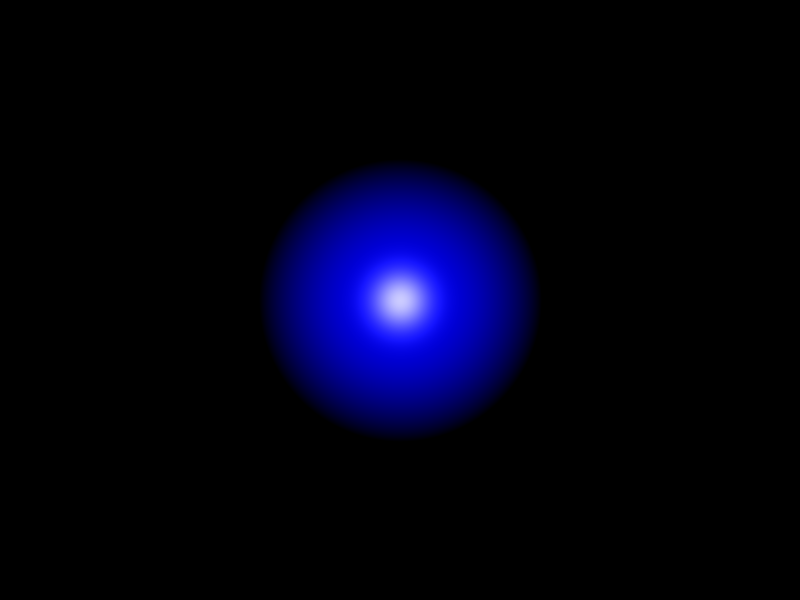
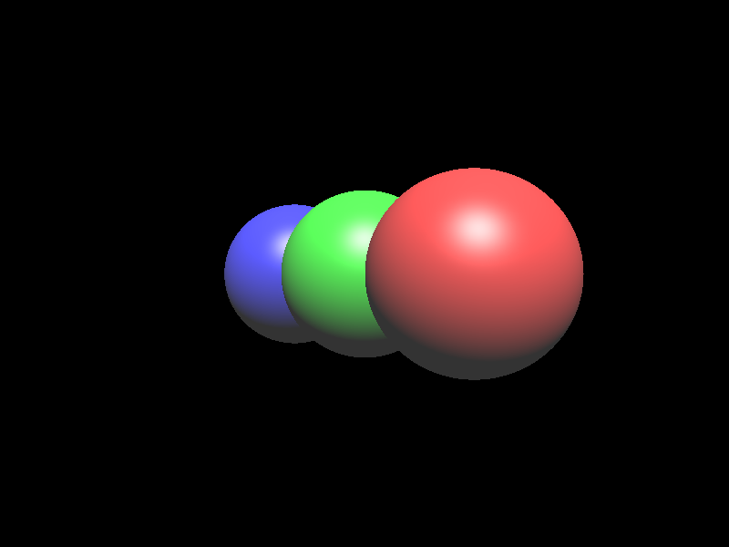
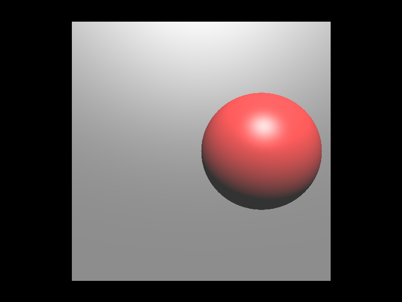
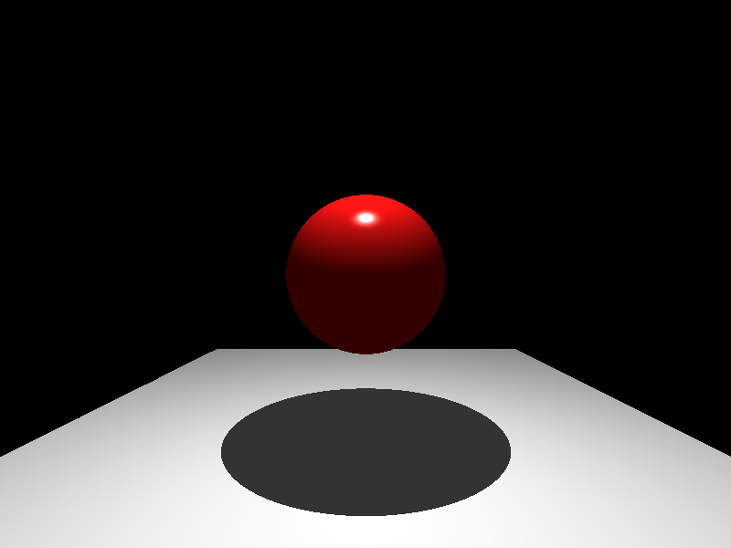

# Rust Ray tracing

An implementation of a very simple raytracing based on [HONG LAB`s Graphics Course Part 1.](https://honglab.co.kr/courses/graphicspt1) in Rust.
I used this project to learn Rust.

**The output is rendered using wgpu without writing file.**


### References
- https://doc.rust-lang.org/book
- https://rinthel.github.io/rust-lang-book-ko
- https://github.com/dps/rust-raytracer

---

### Execute

```shell
# run
cargo run --package raytracing-rs --bin raytracing-rs
```


## Previews

### Phong Shading



### Perspective View


### Triangle


### Shadow


